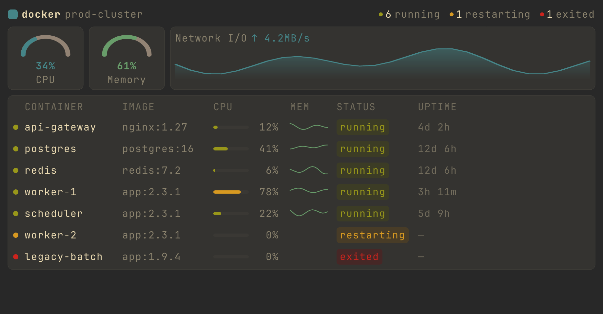
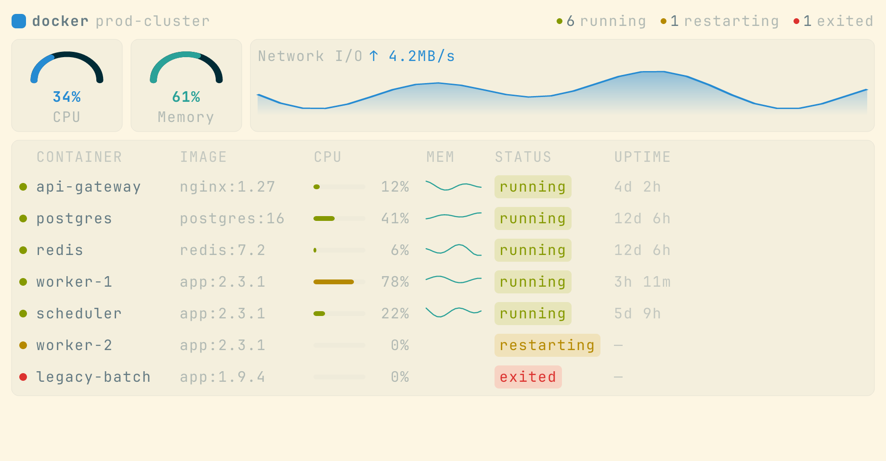
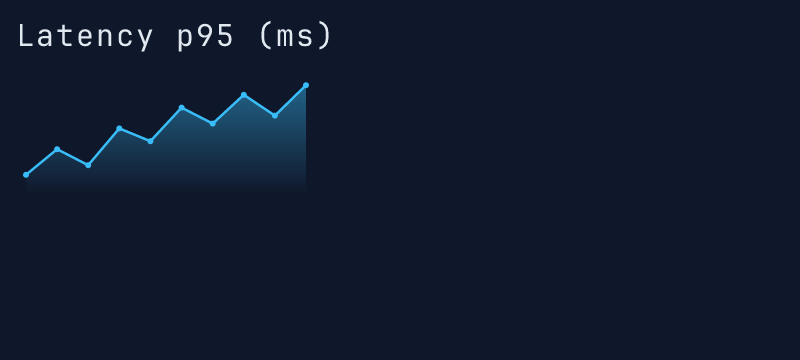
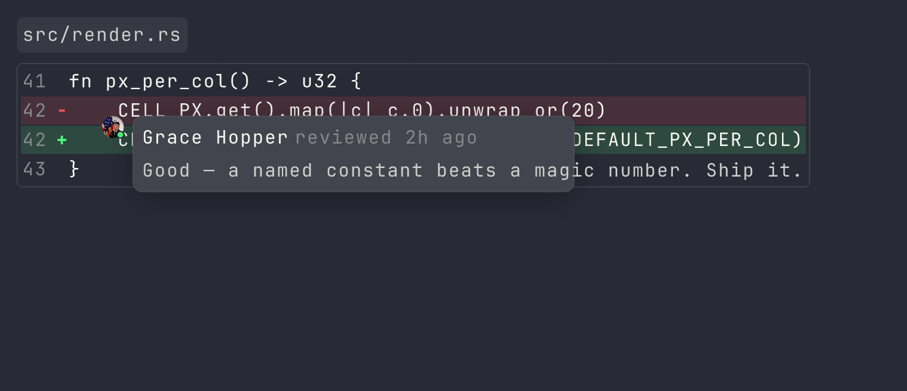
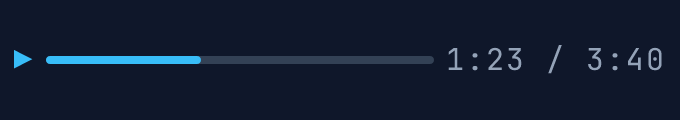
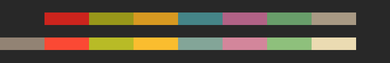
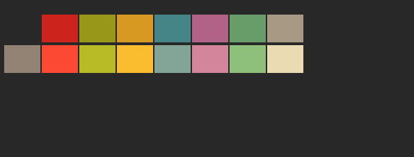
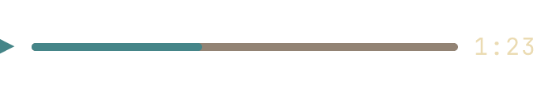

# Terminal Widget Protocol (TWP) — Draft RFC

**Status:** Early proposal, polyfill, no production implementation. **Version:**
Protocol `v=1` (Phase 1)

---

## Abstract

The Terminal Widget Protocol (TWP) is an escape-sequence protocol for terminal
emulators that allows programs to present widgets that precisely fit into the
terminal's monospace grid, typographic configuration, color scheme, and
user-interaction patterns.

TWP allows programs to utilize graphical widgets that respect the terminal's
particular rendering configuration, but can make better use of the space and
colors, allowing CLI/TUI applications to implement features that would otherwise
require a native application or a web application.

A declarative, structured format drives the terminal's built-in rendering. TWP
scenes are a small, bounded vocabulary of nodes and style properties — no
scripting, no DOM, no networking. Because a scene carries real text (`text` /
`mono` nodes) rather than only pixels, a native renderer can keep that text
selectable and exposed to assistive technology, and the declarative tree is the
natural place to later attach semantic roles and labels. TWP supplies the
_meaning_; the terminal and the application keep ownership of behavior.

The included experimental polyfill proves the viability of implementing many of
TWP's features in a separate module, as long as that module has enough
information about how the terminal is going to render text.

This RFC is heavily inspired by and actively builds upon the success of
pre-existing work in this area, especially the Kitty graphics protocol
(https://sw.kovidgoyal.net/kitty/graphics-protocol/), which the polyfill relies
on. TWP, however, has a structured, text-based format, better suited for user
interfaces because it communicates intent to the terminal — rather than raw
pixels — which allows the terminal's renderer to take control of the right
details such as monospace cell size or color settings.

To understand exactly what TWP is designed to be, it's important to distinguish
it from the following things:

- **A document engine**: TWP's nodes do encode information in a structured way,
  and this structure communicates intent, but it mainly communicates intent on
  how the terminal's renderer should behave. A hypothetical application could
  use TWP to display parts of a document, but it would own all aspects of the
  document format and use TWP to render certain aspects of it.
- **A web browser**: TWP borrows web technology to avoid reinventing the wheel
  and facilitate code reuse, but TWP is merely a renderer-agnostic,
  terminal-shaped way to describe static scenes to rendering engines. In other
  words, it is more like "a static SVG but for monospace terminal grids".
- **A TUI/GUI/CLI toolkit**: TWP does not own any aspects of such a toolkit, but
  it could empower existing TUI/CLI toolkits more freedom in what they ask the
  terminal to render.

TWP lets applications express layouts in monospace cells, which means that
layouts can be measured in characters, and making them line up with "raw text"
is a matter of counting characters. Typography is inherited from the terminal,
and so is the color scheme. However, TWP widgets can derive adjusted colors from
the built-in terminal colors, thus allowing for more legible text and cleaner
structure while also fitting neatly into the user's theme.

TWP is transport-framed with the standard ECMA-48 APC mechanism, so terminals
that do not implement it silently ignore TWP messages.

The implementation bundled with this document is a **polyfill** (§3.2): it makes
TWP work on the Kitty terminal and allows experimenting with the protocol, but
it is not production-ready, is not a fully conformant renderer, and exists for
testing and demonstration. In particular, proportional `text` (§5.3) and some
effects (§7.5) are deferred in it.

---

## Status of This Document

This is a **proposal**, open for comments — a "request for comments" in the
literal sense, _not_ an IETF RFC. A few things follow from that, and they are
stated plainly here so there is no confusion about the document's standing:

1. **It is a living document.** It will change in response to feedback and
   implementation experience. Section numbers, key names, and exact spellings
   are not yet stable (§ markers are cross-references within _this_ revision).

2. **There is no formal approval body or process.** No standards organization or
   working group governs terminal-extension protocols, and this document does
   not seek ratification from one. The nearest formal standard, ECMA-48 (the APC
   framing TWP rides on), is long settled and not being extended; there is no
   committee that "accepts" a new sequence. No version of this document becomes
   official by decree.

3. **If TWP becomes a standard, it will be a _de facto_ one** — established the
   way the Kitty graphics protocol and OSC 8 hyperlinks were: a clear, public
   specification plus a working reference implementation, adopted because it is
   useful enough that terminal emulators (and the libraries and applications
   that target them) choose to implement it. **Its reality depends entirely on
   terminal emulators implementing it** — nothing in this document is binding
   until they do.

The intended path, in clean steps:

1. **Publish** the specification and the reference polyfill openly (this repo).
2. **Solicit comments** and iterate this living document.
3. **Demonstrate value**: the polyfill (§3.2) lets applications and frameworks
   use TWP on today's terminals, so the protocol can be evaluated before any
   terminal adopts it.
4. **Native adoption**: terminal emulators implement TWP in their own rendering
   pipelines (§3.3) — the milestone that makes it real.
5. **Convergence**: as implementations agree, the document stabilizes into a de
   facto standard. Compatibility is tracked by the protocol version (`v`);
   backward-incompatible changes bump it, additive changes rely on the "unknown
   ⇒ ignore" rule (§10). Stability comes from agreement among implementations,
   not from a stamp.

Comments, issues, and competing proposals are welcome in the project's public
repository.

---

## Conventions and Terminology

The key words "MUST", "MUST NOT", "REQUIRED", "SHALL", "SHALL NOT", "SHOULD",
"SHOULD NOT", "RECOMMENDED", "NOT RECOMMENDED", "MAY", and "OPTIONAL" in this
document are to be interpreted as described in BCP 14 [RFC 2119] [RFC 8174]
when, and only when, they appear in all capitals, as shown here.

- **Renderer** — the component that interprets TWP messages, lays out the scene,
  rasterizes it, and displays it. May be a terminal itself (§3.3) or a separate
  process (§3.2).
- **Sender** — the application emitting TWP messages.
- **Cell** — one character cell of the terminal grid; `px_per_col` ×
  `px_per_row` pixels, anisotropic and terminal-dependent (§7.3).
- **Scene** — the root widget tree of a TWP message.
- **KGP** — the Kitty graphics protocol. TWP does not depend on it; it is merely
  the display backend the bundled polyfill (§3.2) happens to use. A native
  renderer (§3.3) paints scenes directly and need not involve KGP at all.

**A note on the examples in this document.** For readability, JSON throughout
this document is shown **pretty-printed** (indented, multi-line) and often as a
bare fragment. This is _not_ the wire form. On the wire the payload MUST be a
**single-line, compact JSON document wrapped in the full envelope** —
`ESC _ twp;v=1,c=…,r=… ; {…} ESC \` (§4). The formatted examples are
illustrative only; a real sender always emits the framed, single-line form.

---

## 1. Motivation

The problem TWP addresses is **not** that terminals can't draw graphics — they
can. It is that drawing them _well_ — integrated with the terminal's own
rendering, consistent with its fonts, grid, and theme, and cooperating with
features like text selection and accessibility — is hard, and the entity best
placed to do it (the terminal itself) is never given a description it can work
from. TWP provides that description.

<!-- `> just docker-hero` -->
<!-- BEGIN mdsh -->

| Gruvbox Dark                                                         | Solarized Light                                                                 |
| -------------------------------------------------------------------- | ------------------------------------------------------------------------------- |
|  |  |

<!-- END mdsh -->

_The same scene, two themes._ A Docker dashboard described once as a TWP scene
and rendered by the reference polyfill. Every colour derives from the terminal
palette (`term()` / `color-mix()`), so it re-tones to each theme with no
per-theme code; sizes are in cell units, so it aligns to the grid at any font
size. (Figures and worked examples in this document are real renderer output,
generated in place from their JSON sources by `just docs`; each example shows
the exact JSON that produced its image.)

### 1.1 Pixel-transport protocols solved a different layer

Sixel, the Kitty graphics protocol, and iTerm2 inline images solved a real and
hard problem extremely well: getting arbitrary bitmaps onto the screen, anchored
to the cell grid. By design they operate at the **pixel layer** — the sender
renders the final image and the terminal displays it. TWP is not an alternative
to them; it adds a **complementary layer above** them. Because a transmitted
image is final pixels, the terminal renders it as-is and the content within it
is not something the terminal can reflow, re-theme, make selectable, or expose
to accessibility tooling — not a limitation of those protocols, but simply a
consequence of operating at the pixel layer. TWP describes content at a higher
level so the terminal can take part in rendering it.

### 1.2 The terminal already owns the hard parts; describing content lets it reuse them

When an application produces its own finished pixels, it has to reproduce,
externally, the things the terminal already does well:

- **Font rendering** — the hardest part. The terminal already rasterizes glyphs
  with the user's exact font, size, hinting, and metrics. Reproducing that
  outside the terminal, so widget text matches terminal text, is genuinely
  difficult to get exactly right.
- **The layout grid.** Aligning external graphics to the cell grid depends on
  the live, per-terminal cell pixel size, and needs care to stay aligned across
  font/DPI changes (what TWP's cell units handle; §7.3).
- **The color theme.** Matching the user's terminal color scheme requires
  discovering and tracking the palette; without it, a widget's colors are chosen
  blind to the user's theme (what `term(...)` handles; §8).
- **Terminal features.** Selection, copy, search, reflow, and accessibility
  operate on the terminal's model of the screen, which a finished image does not
  participate in.

A terminal that renders a TWP **description** can reuse all of this directly,
because it owns the font stack, the grid, the palette, and the screen model: the
same widget text can be real, selectable, accessible text, and the colors are
_the user's_ colors. (The bundled polyfill, being external, necessarily
reproduces some of these itself and accepts the resulting imperfections — which
is exactly why native integration is the intended implementation; §3.3.)

### 1.3 A declarative layer is the enabler

For the terminal to do the rendering, it needs to be told _what_ to show, not
handed pixels. So TWP is a **declarative** description — a widget tree with
flexbox layout, styled text, and graphics — that the renderer lays out and draws
itself. Declarativeness is not the goal; it is the mechanism that lets the
terminal own the rendering and thereby deliver the integration in §1.2. (It also
means there is no single "correct" rendering to ship: the same scene can be
drawn to match each terminal.)

### 1.4 Web technology is a natural fit for theming a small palette

The styling model borrows deliberately from the web, because the web has already
solved the problem TWP faces: making a coherent design out of a _small_ set of
colors. **Design tokens** and **color blending** (`color-mix()`, relative
colors) let a whole UI derive every shade from a handful of base colors —
exactly the terminal situation, where the base set is the user's ~16-color
palette. Borrowing this (§8) means a widget can compute tints, muted text, and
elevated surfaces from `term(...)` values and look good against _any_ theme,
light or dark, with no per-theme code — rather than hardcoding colors that clash
with half of users' setups.

### 1.5 A substrate for the rich-terminal-app surge

Finally, TWP aims to be a good **low-level toolkit that CLI/TUI frameworks can
build on**, not an end-user format. There is intense and growing interest in
richer, more interactive terminal applications — dashboards, TUIs, and notably
the wave of **AI agent** tools that live in the terminal and want to present
structured, visual output. These frameworks should not each reinvent a renderer,
a theming system, and a layout engine. A shared declarative primitive underneath
them — one the terminal can render natively — lets that ecosystem focus on the
application, not the pixels.

### 1.6 Why now

Smooth, anti-aliased software rendering with real fonts is cheap and works over
SSH with no GPU. The Kitty graphics protocol established a portable way to
anchor pixels to the cell grid, and the Kitty text-sizing protocol showed
terminals will accept richer text geometry. The remaining missing piece is the
declarative vocabulary — which is what this document specifies.

---

## 2. Design Goals & Non-Goals

### Goals

- **Declarative.** Senders describe _what_ to show, not _how_ to draw it.
- **Cell-native.** Layout aligns to the character grid on any terminal.
- **Theme-reactive.** Color can derive from the terminal palette.
- **Degrade safely.** Unaware terminals ignore TWP; unknown features within a
  TWP message are dropped, never fatal.
- **Reuse what exists.** Framing is plain APC (no new transport). TWP invents
  only the declarative layer; display is left to the implementation — the
  bundled polyfill reuses the Kitty graphics protocol, a native renderer paints
  directly.
- **Native-first, polyfillable today.** The intended implementation wires TWP
  into a terminal's _existing_ rendering pipeline (§3.3). The bundled polyfill
  (§3.2) makes it work _now_ on any Kitty-graphics-capable terminal, so the
  protocol can be used and evaluated before any terminal adopts it.
- **Respect accessibility.** This document does **not** yet offer a mature
  accessibility model — that is acknowledged future work (§13), and a mature
  model will most likely emerge only _after_ the protocol has been implemented
  and used in practice, the same way its other open tradeoffs will (§3.4).
  Accessibility is nonetheless an explicit goal at three levels: (1) **do no
  harm** — a renderer MUST NOT remove accessibility from content it did not
  itself render (e.g. it must not turn previously-selectable terminal text into
  an opaque image); (2) **handle the easy wins the proposal itself creates** —
  because a scene carries real text (`text` / `mono` nodes) rather than only
  pixels, a native renderer can keep that text selectable and exposed to
  assistive technology instead of flattening it into an unreadable image; and
  (3) **be a substrate for future accessibility** — the declarative tree is the
  natural place to later attach semantic roles, labels, and alternative text.
  (The bundled polyfill, rendering to images, does not yet realize level 2; only
  native integration does — §3.3.)

### Non-Goals (Phase 1)

- **Not a browser, document engine, or styling language for the terminal.** The
  node and style vocabulary is deliberately small and bounded (§5–§8); there is
  no scripting, no DOM, no networking, and no general document model. The intent
  is a focused widget primitive, not an open-ended platform — and a terminal may
  implement only a subset, since "unknown ⇒ ignore" (§10) caps the cost of
  partial support.
- Not a general GUI toolkit (no event model, no focus).
- **No renderer-owned animation** in this first iteration: there is no keyframe
  or timeline model that the renderer drives. An application updates or animates
  a widget by **re-sending a TWP message to the same screen region** — the
  renderer replaces the prior rendering there. Motion is therefore _application-
  driven_, frame by frame. (Each scene is static; CSS/SVG animation is neither
  required nor precluded, but is not specified here. Renderer-owned animation is
  noted as possible future work, §13.)
- Not a replacement for the Kitty graphics protocol; it operates at a different
  layer (the polyfill happens to _use_ KGP to display).
- No interactivity/hit-testing in Phase 1 (see §13, Future Work).

---

## 3. Architecture

### 3.1 The model

```text
 sender                      renderer                         display
┌───────────┐   APC + JSON  ┌──────────────────────┐        ┌─────────┐
│  TUI/CLI  │ ────────────► │  parse → resolve →    │ ─────► │  screen │
│           │   twp;…;{…}   │  lay out → rasterize  │ pixels │         │
└───────────┘               └──────────────────────┘        └─────────┘
```

A **renderer** intercepts TWP escape sequences in the byte stream, lays out and
rasterizes the scene to a bitmap, and displays it, having resolved cell units
against the cell pixel size and `term(...)` colors against the active palette
(§7, §8). _How_ the renderer is embedded — as a separate process or inside the
terminal — is an implementation choice, discussed next. Nothing in §4–§10 (the
wire format and semantics) depends on that choice.

### 3.2 The bundled polyfill (what ships here)

The implementation in this repository, `twp-proxy`, is a **polyfill**: a
deliberately simple reference renderer built quickly and pragmatically to prove
the protocol _from the application's side_. It is a PTY proxy — it sits between
an application and a Kitty-graphics-capable terminal, intercepts TWP sequences,
renders each scene to a PNG, transmits it via the Kitty graphics protocol with
Unicode placeholders, and emits a `c×r` placeholder-cell grid where the widget
appears (§9). It queries the terminal for the cell size and palette it needs.

Its job is to let people **use and evaluate TWP today**, on terminals that have
never heard of it. It is explicitly **not normative**: nothing about its
architecture (an out-of-band rasterizer, a specific graphics-protocol backend, a
particular rasterization engine) is prescribed by this document, and it is not
optimized for production. Treat it as a working sketch of the protocol's
_behavior_, not a specification of how a terminal should implement it.

One architectural note: because every Phase 1 node has a grid-determined or
explicitly-sized footprint, the polyfill **lays the scene out itself** — flexbox
over cell units, with `mono` glyphs positioned arithmetically (no recursive text
measurement) — and rasterizes the emitted vector description to a PNG. This is
why proportional `text` is deferred (§5.3, §13): it is the one node that would
need measurement. A native terminal may lay out the same way or differently;
only the wire format and behavior are normative.

### 3.3 The intended implementation: native integration

Where a terminal is able to, the intended implementation is to wire TWP **into
the terminal's existing rendering pipeline** rather than bolting a separate
renderer alongside it. A terminal already has the things the polyfill has to
acquire awkwardly from outside — the live cell metrics, the active palette, the
font stack, a glyph rasterizer and compositor, and authoritative control over
the cell grid. Reusing them avoids the polyfill's seams (out-of-band queries,
the placeholder-image display path, the text/widget coexistence limits noted in
§9) and lets widgets composite with the rest of the screen as first-class
content.

Such a terminal need not use the Kitty graphics protocol at all internally; it
can lay out and paint a TWP scene directly. The wire format and semantics
(§4–§8) are identical regardless.

### 3.4 Both are valid; the right tradeoff is not yet known

A separate renderer (proxy, sidecar, or library) is **also a legitimate
implementation**, not merely a stopgap — for some terminals or use cases it may
be the better balance of simplicity, performance, and correctness (e.g. reusing
a mature CSS/SVG engine the terminal doesn't embed, or isolating an untrusted
rasterizer). This document deliberately does **not** mandate one strategy.

We are explicit that the ideal tradeoff is **genuinely unknown today**. It will
become clear only once TWP is used in practice and observed inside specific
terminal applications — how scenes are actually authored, how large and how
frequent they are, how they interact with scrollback, reflow, and selection, and
where the polyfill's seams hurt versus where they are immaterial. The protocol
is specified so that _either_ strategy is conformant; choosing between them is
left to implementers and to experience.

---

## 4. Wire Format

### 4.1 Framing

A TWP message is a single ECMA-48 **Application Program Command (APC)**:

```text
ESC _  twp;<header>;<payload>  ESC \
```

- `ESC _` (`0x1B 0x5F`) — APC introducer. Senders MUST emit this 2-byte form,
  and renderers MUST NOT treat the 8-bit C1 byte `0x9F` as an introducer: it is
  a common UTF-8 continuation byte (e.g. in `ß`, `ş`), so scanning for it would
  corrupt the framing of ordinary multilingual text.
- `twp;` — the TWP namespace prefix. A renderer dispatches only APC sequences
  beginning with this prefix; all other APCs pass through untouched.
- `<header>` — comma-separated `key=value` control fields (§4.2).
- `;` — separates header from payload. The header extends to the **first** `;`;
  everything after it is the payload (which may itself contain `;`). The header
  therefore MUST NOT contain a `;`.
- `<payload>` — a single compact (single-line) JSON document (§4.3).
- `ESC \` (`0x1B 0x5C`, ST) — string terminator. Senders MUST emit this 2-byte
  form; renderers MUST NOT treat the 8-bit C1 byte `0x9C` as a terminator, for
  the same UTF-8 reason.

Because APC content is opaque to the terminal, a terminal that does not
implement TWP swallows the entire sequence and displays nothing — TWP's baseline
graceful-degradation property.

### 4.2 Header fields

| Key | Meaning                                          | Required |
| --- | ------------------------------------------------ | -------- |
| `v` | Protocol version. This document specifies `v=1`. | yes      |
| `c` | Cell **columns** the widget occupies.            | yes      |
| `r` | Cell **rows** the widget occupies.               | yes      |

Unknown header keys MUST be ignored (forward-compatibility). A renderer that
does not support the declared `v` MUST ignore the message.

`c` and `r` declare the widget's **cell footprint** — the rectangle of character
cells the rendered image will occupy. They let the renderer reserve grid space
and size the output without parsing the payload. A sender MUST include `c` and
`r`; a renderer MAY assume a sensible default footprint (the polyfill uses 20×4)
if they are absent, and MUST treat a missing `v` as `v=1`. The polyfill's
leniency here is a non-normative liberty, not a required behavior.

Example header: `twp;v=1,c=40,r=6;`

### 4.3 Payload (JSON)

The payload MUST be a single **UTF-8-encoded, compact (single-line) JSON
object**, with all control characters U+0000–U+001F `\u`-escaped (as standard
JSON encoders do). So encoded, the payload contains no raw `ESC` and no raw
newline — which is exactly what makes it APC-safe and lets it ride the channel
verbatim with no further encoding. (A renderer MUST NOT scan a UTF-8 payload for
the bare 8-bit bytes `0x9C`/`0x9F`; see §4.1.)

Top-level keys:

| Key | Meaning                                                             |
| --- | ------------------------------------------------------------------- |
| `S` | **Scene** — the root node of the widget tree (§5).                  |
| `C` | **Components** — a map of `name → node` definitions for reuse (§6). |

Both are optional; a payload with neither is a no-op. A payload with only `C`
registers definitions (renderers MAY treat definitions as per-message).

Minimal example (full message):

```text
ESC _ twp;v=1,c=8,r=1;{"S":{"n":"mono","t":"hello"}} ESC \
```

---

## 5. The Scene Graph

A **node** is a JSON object:

```json
{ "n": "<type>", "s": { …style… }, "c": [ …children… ], "t": "<text>" }
```

| Field           | Meaning                                                 |
| --------------- | ------------------------------------------------------- |
| `n`             | Node type (below). Required.                            |
| `s`             | Style object (§7, §8). Optional.                        |
| `c`             | Array of child nodes. Optional.                         |
| `t`             | Text/source content; meaning depends on type. Optional. |
| `img`           | Image source, for `img` nodes (§5.6). Optional.         |
| `name`, `props` | Component machinery (§6). Optional.                     |

### 5.1 `flex` — flex container

A CSS-flexbox container. Honors `flex-direction`, `justify-content`,
`align-items`, `gap`, plus sizing/visual style. Children flow per the flex
algorithm. This is the primary layout primitive.

### 5.2 `box` — block container

A styled block container (no flex layout). Used for solid fills, spacers, bars,
dots — anything that is "a rectangle with style."

### 5.3 `text` — proportional text

A run of text (`t`) rendered in a **proportional** font at `font-size`. For
prose, headings, captions — content that is _not_ meant to align to the cell
grid.

**Phase 1 status (informative).** `text` is the one node whose size is not
grid-determined: each glyph has its own advance width, so laying one out
requires measuring and wrapping the text — in contrast to `mono`, where every
glyph occupies a fixed cell block (§7.4) and needs no measurement. `text` is
therefore an **optional** Phase 1 node: a renderer MAY implement it, and a
renderer that does not MAY render a `text` node as a styled `mono` run or drop
it under the §10 degradation rules. The node type remains part of the
vocabulary, but nothing in Phase 1 mandates proportional shaping. (See §13.)

### 5.4 `mono` — monospace-grid text

A run of text (`t`) where **each character occupies exactly one (or `scale`)
character cell**, laid out on the grid rather than by the font's advance widths.
This is the primitive that keeps text aligned with surrounding cells.

`mono` honors the text-sizing parameters (§7.4), mirroring the Kitty text-sizing
protocol: `scale` (an `s×s`-cell block per glyph), `char-width` (cells per
glyph), and `subscale-n`/`subscale-d` (a fractional glyph size within the cell
block).

### 5.5 `svg` — inline vector graphics

`t` carries inline SVG markup. The renderer rasterizes it into the node's box.
Enables smooth curves, arcs, gauges, sparklines, and gradient fills that the box
model cannot express. SVG `fill`/`stroke` accept `term(...)` colors and
`currentColor` (§8).

<!-- `> just figure app_line_chart svg-line-chart` -->
<!-- BEGIN mdsh -->



<!-- END mdsh -->

_An `svg` node: smooth curves and a gradient fill that the box model can't
express, rasterized by the renderer into the node's box._

### 5.6 `img` — bitmap image

An `img` node carries an `img` object describing a bitmap, with keys
intentionally mirroring the Kitty graphics protocol so the same source
description is portable:

| Key      | Meaning                                                             |
| -------- | ------------------------------------------------------------------- |
| `f`      | Format: `100` = encoded (PNG, default), `32` = RGBA, `24` = RGB.    |
| `t`      | Transmission: `"d"` = direct base64 in `d`; `"f"` = file at `path`. |
| `s`, `v` | Pixel width / height (required for raw `f=32`/`f=24`).              |
| `d`      | Base64 payload.                                                     |
| `path`   | Filesystem path (for `t=f`).                                        |

The node's `border-radius` clips the image (e.g. circular avatars).

### 5.7 `stack` — z-layered overlay

Children are painted as full-bleed layers, later children on top — a z-order
overlay. Used for scrims over images, badges on corners, and floating popovers.
Each layer occupies the stack's full box; position within a layer is achieved
with a nested `flex`.

<!-- `> just figure diff_review_dracula diff-review` -->
<!-- BEGIN mdsh -->



<!-- END mdsh -->

_A `stack` overlay: a review-comment popover (avatar, bubble, drop shadow)
floating over a syntax-tinted diff._

### 5.8 Unknown node types

A renderer encountering an unknown `n` MUST NOT fail; it SHOULD render nothing
(or an empty box) for that node and continue. This makes new node types
forward-compatible.

---

## 6. Components (`C` / `$`)

To avoid repeating subtrees, a payload may define reusable components in `C` and
invoke them in the scene:

- A definition is a node tree containing **holes**: nodes with `n: "$param"` and
  a `name`, marking where invocation-supplied content goes.
- An **invocation** is a node whose type is `$<name>` (referring to a key in
  `C`), carrying a `props` map. Each prop fills the matching `$param` hole.
- For ergonomics, a prop given as a bare string is wrapped in a `text` node; a
  prop given as an object is used as a full node tree.

Components are expanded before layout. They are a convenience for senders (e.g.
a table row template); the expanded tree is what §5 describes.

---

## 7. Style — Sizing & Layout

Style is a JSON object under `s`. Phase 1 defines a typed vocabulary; any
property not listed is treated as a raw CSS declaration passed to the rasterizer
(§7.5). Unknown/unparseable declarations are dropped.

**Grid stability — the core invariant.** Style splits into two kinds, and they
do not mix:

- **Layout** — `width`, `height`, `padding`, `gap`, `flex-*` — expressed in cell
  units (§7.3). Layout _positions_ things, so a node's content lands on the
  terminal's character grid.
- **Paint** — `background`, `border`, `border-radius`, and any decorative effect
  (§7.5) — _colours pixels_. Paint MUST NOT change the size or position of a
  node, its content, or its siblings. Paint MAY bleed past a node's box (an
  overlapping border ring or shadow is fine).

Consequently a `border` is painted at the node's edge and **does not displace
its content** — a 1px border never nudges the glyphs inside it off the grid,
whatever the axis. Content leaves the cell grid only when the author explicitly
asks for it with a sub-cell `px` value. (How a renderer realises non-displacing
paint is its own affair — the polyfill, for instance, paints the typed `border`
as an SVG edge stroke _after_ layout, so it sits on top of the box and never
shifts content; §3.2.)

### 7.1 Layout (on `flex`)

`flex-direction` (`row`|`column`|…), `justify-content`, `align-items`, `gap`,
`padding`. Values follow CSS semantics.

<!-- `> just figure now_playing_bar now-playing` -->
<!-- BEGIN mdsh -->



<!-- END mdsh -->

_Flex layout: the play glyph and time label are fixed; the progress track
carries `flex-grow` and absorbs the remaining width. Spacing is in cell units,
so the bar stays aligned at any font size._

### 7.2 Sizing

`width`, `height`, `border-radius` take a **length** (§7.3). `gap` and `padding`
likewise.

Visual paint keys — `background`, `color`, `border-radius`, `opacity`, and
`border` (`{ "width": <px>, "color": <color §8> }`, a solid edge) — colour the
node and, per §7's grid-stability rule, never change its layout. A `border`'s
`width` is in pixels (a hairline is 1 device pixel on every terminal); it is
painted at the edge and may bleed outward, but does not displace the node's
content. `opacity` is a number in 0–1 that fades the node's paint.

**Text keys.** `font-size` (px), `font-weight` (`"normal"`, `"bold"`, or a
number 100–900), and `text-align` (`left`|`center`|`right`) style text nodes. In
Phase 1 these apply to the grid-sized `mono`/`text` runs; `font-weight` selects
the bold face and `text-align` is meaningful where the run occupies more width
than its glyphs.

### 7.3 Lengths and cell units

A length is either a bare number (**pixels**) or a string with a unit:

| Form     | Unit                          | Resolves to                                  |
| -------- | ----------------------------- | -------------------------------------------- |
| `42`     | pixels                        | `42px` (escape hatch for sub-cell cosmetics) |
| `"50%"`  | percent                       | 50% of the parent's corresponding axis       |
| `"3mcw"` | monospace **cell width** (x)  | `3 · px_per_col`                             |
| `"2mch"` | monospace **cell height** (y) | `2 · px_per_row`                             |

Percentages resolve against the parent's corresponding axis — most useful for
`width`/`height`. For `gap`/`padding`/`border-radius` their effect is
renderer-defined and typically small; when in doubt, prefer cell units for
spacing.

**Cell units are TWP's native length unit and the key to portability.** The
character cell is _anisotropic_ (typically ~1:2, taller than wide) and its pixel
size varies per terminal (font, size, DPI). A widget sized in pixels aligns to
the grid only on the terminal it was authored on; a widget sized in cell units
aligns _everywhere_, because the renderer resolves `mcw`/`mch` against the live,
per-terminal cell size.

There are exactly two base units because the cell has two independent axes
(`mcw`, `mch`). A cell unit resolves to a fixed pixel count regardless of which
property it is applied to, so a **pixel-square** element — an icon, status dot,
circular avatar — is just the _same_ unit on both sides: `width: "1mcw"` with
`height: "1mcw"` is a `px_per_col`-by-`px_per_col` box on every terminal. (There
is deliberately no separate "min/max" cell unit: on a taller-than-wide cell
`mcw` is already the smaller side, so a width-only fraction would only have
reintroduced it under another name.)

**Cross-axis harmony is per-axis, not a fused base.** Each axis self-corrects
against its own live pixel count — that _is_ the both-axes handling. A single
number derived from both axes (a geometric mean, a "fits-the-cell" square) would
bake in one terminal's aspect ratio and drift on every other. So size each axis
in its own unit and quantise to whole or quarter cells
(`0.25/0.5/0.75/1 · mcw |
mch`) rather than reaching for an eyeballed decimal.

Guidance: use cell units for all layout (columns, gaps, padding, bars) and for
square/round graphics (the same unit on both axes) and SVG node boxes (the SVG
`viewBox` preserves internal proportion). Reserve pixels for genuinely sub-cell
cosmetics — and recall that a hairline `border` is _paint_ (§7), so its `px`
width never shifts content regardless of axis.

### 7.4 Mono text sizing

On `mono` nodes (mirroring the Kitty text-sizing protocol):

| Key                         | Meaning                                                                                                                                                                                          |
| --------------------------- | ------------------------------------------------------------------------------------------------------------------------------------------------------------------------------------------------ |
| `scale`                     | Each glyph occupies a `scale × scale` block of cells.                                                                                                                                            |
| `char-width`                | Cells per glyph horizontally.                                                                                                                                                                    |
| `subscale-n` / `subscale-d` | Glyph drawn at `n/d` of the cell block (a finer sub-grid). `subscale` only _shrinks_: `n` is clamped to `≤ d`, and `d` MUST be `> 0` (a `0` or absent `d` renders the glyph at full block size). |

### 7.5 The passthrough rule

A renderer recognizes a small set of **typed** layout and visual keys
(§7.1–§7.4, plus `flex-grow`, `max-width`, `opacity`, and the text keys in
§7.2). Any style key **not** in the typed vocabulary is treated as an **effect**
whose handling is left to the renderer. The bundled polyfill recognizes exactly
one such effect — `box-shadow` — and drops every other unknown key, preserving
forward-compatibility. A native renderer may support a broader set; the spec
requires only that an unknown or unparseable key be **ignored, never fatal**
(§10). `term(...)` colors and cell units are resolved inside recognized
passthrough values too.

The vocabulary is intentionally bounded: the core a conformant renderer must
implement is the typed nodes plus the typed style keys. This is what keeps the
"small, bounded vocabulary" claim true — there is no unbounded CSS surface.

---

## 8. Style — Color & Theming

Color-valued properties (`color`, `background`, SVG `fill`/`stroke`, borders,
gradients, …) accept:

### 8.1 Literal colors

CSS hex (`#rrggbb`, `#rgb`, `#rrggbbaa`) and the keyword `transparent`. A
transparent background composites the widget over the terminal cells beneath it.

### 8.2 Terminal palette — `term(...)`

`term(...)` draws from the terminal's _own_ color scheme:

| Form                     | Meaning                                              |
| ------------------------ | ---------------------------------------------------- |
| `term(fg)`               | Default foreground.                                  |
| `term(bg)`               | Default background.                                  |
| `term(0)` … `term(15)`   | The 16 ANSI palette colors (theme-dependent).        |
| `term(16)` … `term(255)` | The 256-color cube / grayscale ramp (fixed formula). |

The renderer learns the palette by querying the terminal (the polyfill uses OSC
4 / OSC 10 / OSC 11). Because indices 0–15 are theme-defined, `term(2)` is "this
user's green," not a fixed RGB — so a widget built on `term(...)` adopts the
user's color scheme automatically.

| Native ANSI swatches (`\e[48;5;Nm`)                                          | The same colours via `term(0)`…`term(15)`                                                       |
| ---------------------------------------------------------------------------- | ----------------------------------------------------------------------------------------------- |
|  |  |

_`term()` resolves to the terminal's own palette: the swatches the terminal
prints natively (left) and the same sixteen colours requested via `term()` and
rendered by the polyfill (right) match, because both come from the queried
palette._

### 8.3 Derived colors

Standard CSS color functions are accepted, most usefully `color-mix()`:

```text
color-mix(in srgb, term(2) 15%, term(bg))
```

This expresses _derived_ theme tones — an "added line" tint as the green accent
mixed lightly into the background, "muted" text as the foreground pulled toward
the background, elevated surfaces as subtle lifts off `term(bg)`. A complete UI
can thus derive **every** color from the palette and re-tone itself to any
theme, light or dark, with no per-theme code. (Relative color syntax such as
`rgb(from term(1) r g b / .3)` is not implemented by the bundled polyfill and is
left to renderers.)

### 8.4 `currentColor` (SVG)

Within an `svg` node, `currentColor` resolves to the node's `color`, letting
vector art inherit a (possibly `term()`-derived) theme color.

---

## 9. Rendering & Display Model

A renderer processes a TWP message as:

1. **Parse** the APC header and JSON payload; expand components (§6).
2. **Resolve** cell units against the queried cell pixel size and `term(...)`
   colors against the queried palette.
3. **Lay out and rasterize** the scene into a bitmap sized to `c × r` cells.
4. **Display** the bitmap anchored to a `c × r` block of character cells.

The polyfill implements step 4 with the **Kitty graphics protocol using Unicode
placeholders**: it transmits the image (`a=T,f=100,U=1,c=…,r=…`) and emits a
`c × r` grid of `U+10EEEE` placeholder cells (image id encoded in the cell
foreground color, row/column via combining diacritics). The terminal paints the
transmitted image into exactly those cells. A native implementation may use any
equivalent mechanism.

**Cell footprint.** The widget occupies exactly the `c × r` cells declared in
the header. Sizing the scene root to `width:100%; height:100%` fills that box;
the cell-unit system (§7.3) ensures internal elements align to the same grid.

**Coexistence (informative).** In the polyfill, a placeholder-image widget and
ordinary printed text do not currently share the same screen region cleanly;
widgets are best placed in regions the application manages as widget real
estate. A tighter cell-by-cell coexistence model (analogous to `ratatui-image`)
is future work (§13).

---

## 10. Compatibility, Degradation & Versioning

TWP degrades at three levels:

1. **Wrapper-unaware terminal.** Any terminal that does not implement TWP
   swallows the APC (standard ECMA-48 behavior) and shows nothing. (An optional
   sender-supplied plain-text rendering printed _outside_ the APC could let such
   terminals show a fallback; see §13.)
2. **Unknown node type.** Rendered as nothing; the rest of the scene renders
   (§5.8).
3. **Unknown style property / value.** Dropped; the rest of the style applies
   (§7.5).

**Versioning.** `v=1` identifies this protocol revision. Renderers MUST ignore
messages whose `v` they do not support. New _additive_ features (node types,
style properties, header keys) do not require a version bump because each
degrades individually; `v` increments only on incompatible changes.

This "unknown ⇒ ignore, never fail" rule is the protocol's entire
forward-compatibility story and applies uniformly at every layer.

---

## 11. Security Considerations

- **Resource use.** A scene can request large images, deep trees, or large
  rasterization targets. Renderers SHOULD bound payload size, tree depth, image
  dimensions, and total rasterized area, and SHOULD rate-limit messages.
- **File access (`img` `t=f`/`path`).** Reading arbitrary filesystem paths named
  by an untrusted sender is dangerous. Renderers SHOULD restrict or disable
  path-based image sources, or sandbox them, especially over SSH or when the
  sender is not the local user.
- **SVG.** SVG can reference external resources and is a historically rich
  attack surface. Renderers MUST disable external entity/resource loading and
  scripting, and SHOULD use a hardened, static SVG rasterizer.
- **Palette/cell queries.** The renderer emits terminal queries (OSC 4/10/11,
  cell-size) and reads responses; it MUST parse these defensively and time out
  rather than block.
- **Untrusted output.** As with any escape-sequence feature, programs that emit
  attacker-controlled bytes can emit TWP. The "unknown ⇒ ignore" rule limits
  blast radius, but the resource and file-access bounds above are essential.

---

## 12. Relationship to Prior Art

- **Kitty graphics protocol.** Conceptually the layer _below_ TWP — the
  imperative pixel layer, where TWP is a declarative description above it. The
  bundled polyfill uses it as its display backend, but TWP does not require it;
  `img` source keys deliberately mirror it for portability.
- **Kitty text-sizing protocol (OSC 66).** TWP's `mono` sizing (`scale`,
  `char-width`, `subscale`) mirrors it, generalized into a layout context.
- **Sixel / iTerm2 inline images.** Alternative pixel-display primitives; TWP
  could target them as display backends.
- **CSS / flexbox / SVG.** TWP's style and layout semantics are intentionally a
  subset of CSS, so the model is familiar and the passthrough rule (§7.5) keeps
  the vocabulary bounded rather than importing a full CSS engine.
- **TUI frameworks (ratatui, etc.).** TWP is complementary: a TUI could emit a
  TWP scene for a region instead of (or alongside) cell characters, gaining
  sub-cell rendering while keeping the cell grid as the coordinate system.

---

## 13. Open Questions & Future Work

- **Proportional text.** `text` nodes (§5.3) are the only nodes whose size is
  not determined by the grid — each glyph has its own advance width — so laying
  one out requires measuring and wrapping proportional text. This is the single
  place the "cell units ⇒ no measurement" property does not hold, and it is why
  the bundled polyfill renders `text` as a monospace run today. Phase 1 treats
  `text` as optional (§5.3). A future revision could add a defined
  proportional-text layout (advance-width measurement and wrapping) to the core,
  or standardize a fallback such as rendering `text` as a `mono` run; a simpler
  polyfill that lays scenes out itself defers proportional text accordingly.
- **Terminal multiplexers.** tmux/screen sit between the application and the
  terminal and historically do not forward unknown escape sequences reliably.
  TWP rides standard APC, which a multiplexer _should_ pass through unchanged
  under the same "unknown ⇒ ignore" principle — and an unaware multiplexer that
  swallows it degrades safely (no corruption). In practice, passthrough of APC,
  and of the polyfill's KGP backend, through tmux/screen is a known, unsolved
  problem shared by _all_ terminal-graphics protocols, and is not something TWP
  can fix unilaterally. Two forward-looking notes: a multiplexer can already
  forward sequences explicitly (e.g. tmux's passthrough mode); and because a TWP
  message is a _declarative description_ rather than opaque pixels, a TWP-aware
  multiplexer could place and reflow widgets across panes far better than it can
  with bitmap protocols. Deferred; honestly unsolved for now.
- **Chunking.** Large payloads (image-bearing scenes) may exceed terminal APC
  length limits. A continuation mechanism (à la Kitty's `m=1`) is the main
  realistic addition; deferred until needed.
- **Optional transfer encoding.** A compact-JSON payload is already APC-safe and
  needs no encoding. A future optional `enc=` field could allow compressed
  (`zlib`+base64) payloads for bandwidth, with "unknown enc ⇒ ignore." Not part
  of Phase 1.
- **Plain-text fallback.** A standard way to attach an out-of-band plain-text
  rendering for wrapper-unaware terminals (§10).
- **Accessibility semantics.** A mature accessibility model (§2): node-level
  semantic roles, accessible names/labels, and alternative text, plus a defined
  mapping from the scene tree to platform accessibility trees and to the
  terminal's own a11y surface. Phase 1 establishes only the goals — do no harm,
  keep declared text exposable, and leave room for this — not the vocabulary.
- **Interactivity.** A cell→node hit map plus an input convention would enable
  buttons, hover, and focus. Out of scope for Phase 1, but the declarative tree
  is a natural substrate for it.
- **Capability negotiation.** A query/response for "does this terminal support
  TWP `v`, and which features?" so senders can choose between a TWP rendering
  and a degraded one without guessing.
- **Generalized envelope (note).** TWP frames on plain APC like its peers. The
  framing/encoding/dispatch concerns _could_ be factored into a shared envelope
  reused by multiple terminal-extension sub-protocols; this is recorded as a
  possibility, not proposed here — its value depends on multi-protocol adoption
  that TWP alone does not require.

---

## References

### Normative

- **[RFC 2119]** Bradner, S., "Key words for use in RFCs to Indicate Requirement
  Levels", BCP 14, RFC 2119, March 1997.
- **[RFC 8174]** Leiba, B., "Ambiguity of Uppercase vs Lowercase in RFC 2119 Key
  Words", BCP 14, RFC 8174, May 2017.
- **[ECMA-48]** ECMA-48, "Control Functions for Coded Character Sets" (= ISO/IEC
  6429), 5th edition — the APC / string-control-sequence framing TWP rides on.

### Informative

- **[KGP]** Kitty Graphics Protocol — the display backend used by the bundled
  polyfill (not part of TWP itself), including Unicode placeholders.
  <https://sw.kovidgoyal.net/kitty/graphics-protocol/>
- **[OSC 66]** Kitty Text-Sizing Protocol — basis for `mono` `scale` /
  `char-width` / `subscale`.
  <https://sw.kovidgoyal.net/kitty/text-sizing-protocol/>
- **[OSC 8]** Hyperlinks in terminal emulators (Egmont Koblinger et al.) — prior
  art for a community-published, adopted-by-reference terminal extension.
- **CSS** — Flexbox, color, and `color-mix()` semantics that TWP's style
  vocabulary mirrors (W3C CSS specifications).

---

## Appendix A — Worked Examples

Each example is generated from a single source file in `examples/` by `mdsh`
(`just docs`): the JSON shown is exactly what produced the image beneath it, so
the two cannot drift. Colours use `term()`/`color-mix()`, shown here in the
Gruvbox Dark palette.

### A.1 A themed status pill (cell-native, theme-derived)

<!-- `> just example status-pill 24 3 "Gruvbox Dark"` -->
<!-- BEGIN mdsh -->

```json
{
  "S": {
    "n": "flex",
    "s": {
      "justify-content": "center",
      "align-items": "center",
      "width": "100%",
      "height": "100%",
      "background": "term(bg)"
    },
    "c": [
      {
        "n": "flex",
        "s": {
          "background": "color-mix(in srgb, term(2) 18%, term(bg))",
          "border-radius": "0.5mcw",
          "padding-left": "0.5mcw",
          "padding-right": "0.5mcw"
        },
        "c": [{ "n": "mono", "t": "running", "s": { "color": "term(2)" } }]
      }
    ]
  }
}
```


<!-- END mdsh -->

### A.2 A flex-grow media bar (fixed glyph, growing track, fixed time)

<!-- `> just example media-bar 34 3 "Gruvbox Dark"` -->
<!-- BEGIN mdsh -->

```json
{
  "S": {
    "n": "flex",
    "s": {
      "flex-direction": "row",
      "align-items": "center",
      "gap": "1mcw",
      "width": "100%",
      "height": "100%"
    },
    "c": [
      { "n": "mono", "t": "▶", "s": { "color": "term(4)" } },
      {
        "n": "flex",
        "s": {
          "flex-grow": 1,
          "height": "0.25mch",
          "background": "term(8)",
          "border-radius": "0.25mcw"
        },
        "c": [
          {
            "n": "box",
            "s": {
              "width": "40%",
              "height": "0.25mch",
              "background": "term(4)",
              "border-radius": "0.25mcw"
            }
          }
        ]
      },
      { "n": "mono", "t": "1:23", "s": { "color": "term(fg)" } }
    ]
  }
}
```



<!-- END mdsh -->

Full message form: `ESC _ twp;v=1,c=COLS,r=ROWS;<compact json> ESC \`.

---

_This is a first draft for discussion. Section numbering, key names, and the
exact unit/keyword spellings are subject to change based on review._
